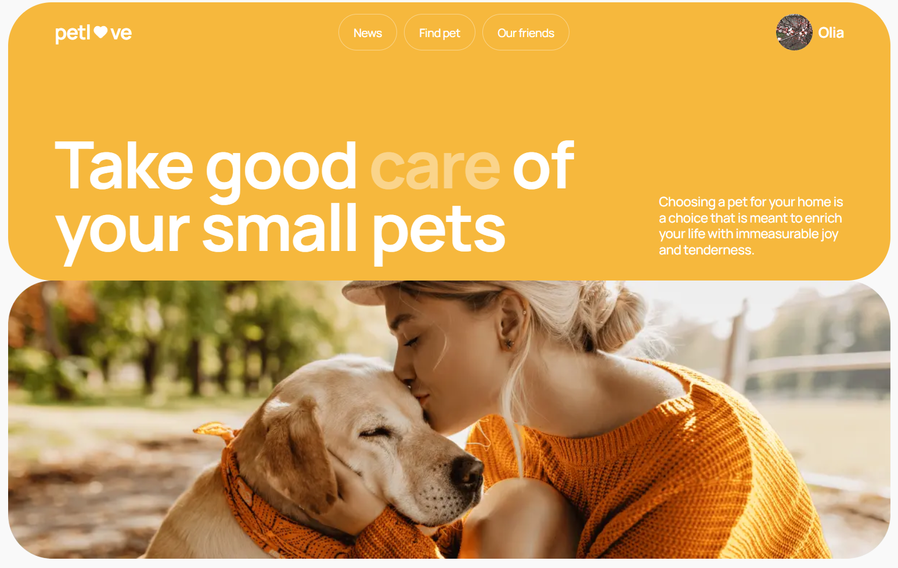
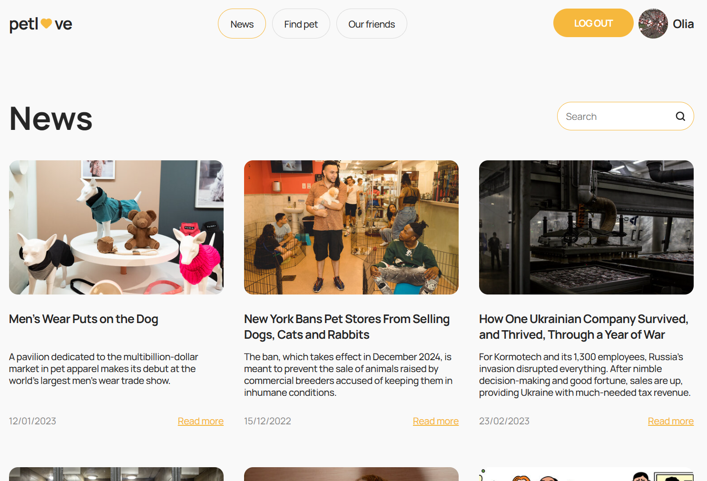
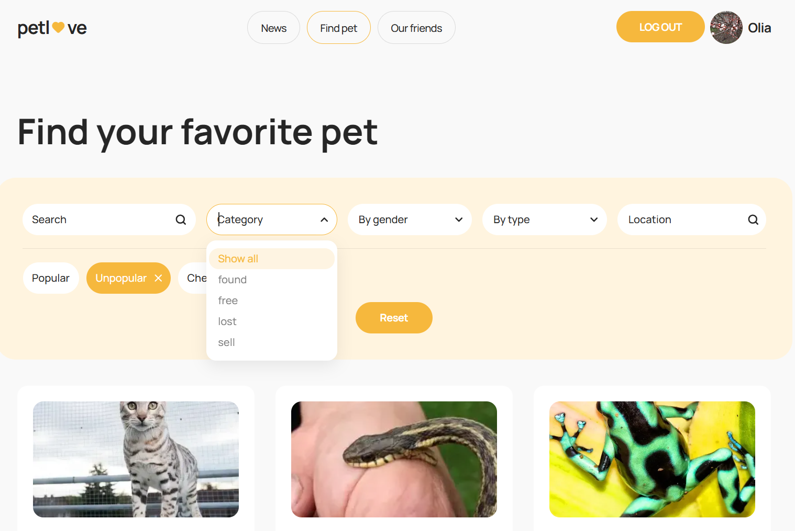
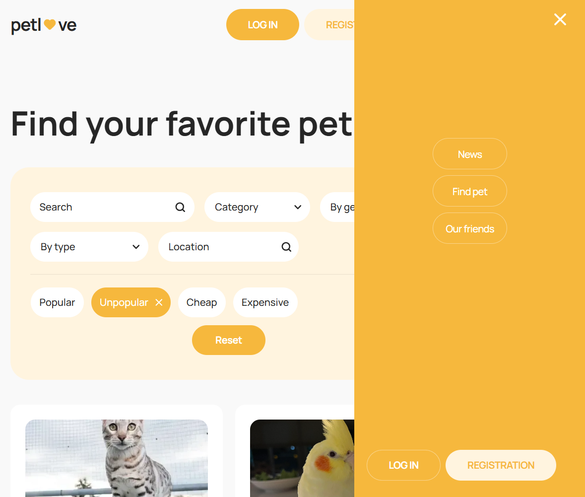
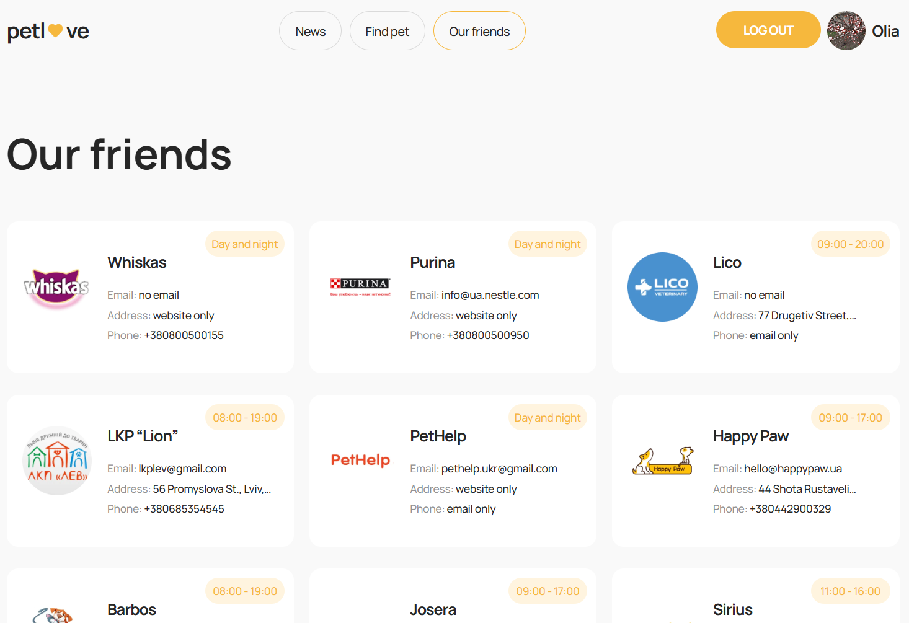
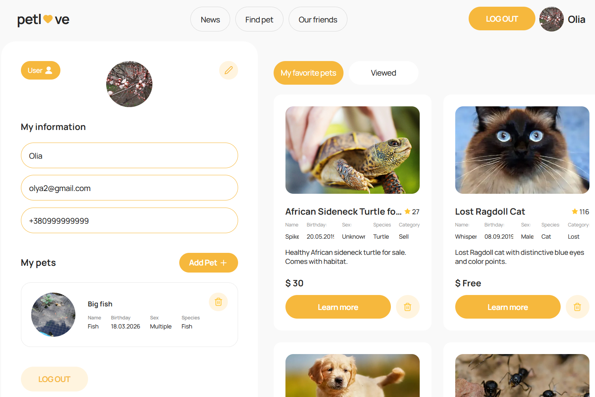
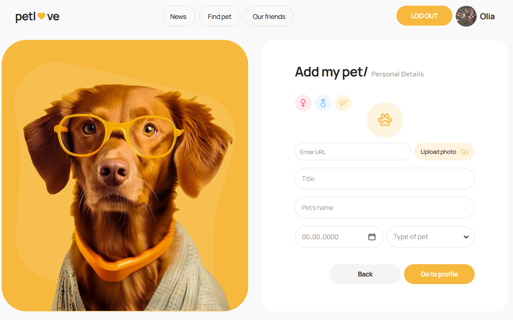

# 🐾 PetLove App

A modern web application for finding, saving, and managing pets.
Users can browse notices, read news, manage favorites, and create their own pet profiles.

## 🎨 Design (Figma)

👉 [View Figma Design](https://www.figma.com/file/puMNfZVg4YI8UZoJ1QiLLi/Petl%F0%9F%92%9Bve?type=design&node-id=55838-750&mode=design&t=Xg1IwIcKebTl5xGs-0)

## 📸 Screenshots

### 🏠 Home Page

<p align="left">
  
</p>

### 📰 News Page

<p align="left">
  
</p>

### 🐶 Notices Page

<p align="left">
  
  
</p>

### 🤝 Friends Page

<p align="left">
  
</p>

### 👤 Profile Page

<p align="left">
  
</p>

### ➕ Add Pet Page

<p align="left">
  
</p>

## 🚀 Pages

- 🏠 **Home** — landing page

- 📰 **News** — latest pet-related news with search

- 🐾 **Notices** — browse pets with filters & pagination

- 🤝 **Friends** — partners / organizations list

- 👤 **Profile** — user info, pets, favorites, viewed

- ➕ **AddPet** — create your own pet profile

## 🚀 Features

- 🔐 Authentication (register / login / logout)

- 🔎 Search & filtering system

- 📄 Pagination

- ❤️ Add/remove favorites

- 👁 Viewed notices history

- 🐕 Add & delete pets

- ✏️ Edit user profile

- 📱 Responsive design

- ⚡ Loaders (page + list)

- 🧩 Skeleton components for smooth UX

## 🛠 Tech Stack

### Frontend:

- React

- TypeScript

- Redux Toolkit

- React Router

- Axios

### State & Logic:

- Redux Thunk

- Redux Persist

### Forms & Validation:

- Formik

- Yup

- React-select

### UI:

- CSS Modules

- Adaptive layout

- Skeleton loaders

## 📂 Project Structure

```bash
src/
│
├── components/        # Reusable UI components
│   ├── Button/
│   ├── Loader/
│   ├── NoticesList/
│   └── ...
│
├── pages/             # Application pages
│   ├── HomePage/
│   ├── NewsPage/
│   ├── NoticesPage/
│   ├── FriendsPage/
│   ├── ProfilePage/
│   └── AddPetPage/
│
├── redux/             # State management
│   ├── auth/
|   ├── authInterceptor/
│   ├── news/
│   ├── user/
│   ├── notices/
│   ├── friends/
│   └── global/
│
├── hooks/
├── utils/
├── assets/
└── main.tsx
```

## ⚙️ Installation & Setup

```bash
# Clone repository

git clone https://github.com/your-username/your-project.git

# Go to project folder

cd your-project

# Install dependencies

npm install

# Run project

npm run dev
```

## 🌐 API

Used for:

- authentication

- users

- pets

- notices

- news

- friends

## 📌 Key Implementation Details

### 🔎 Smart search

- keyword is sent only when not empty

### ⏳ Loading system

- isPageLoading → global loader (Layout)

- isListLoading → skeletons in lists

### 🐾 Pets management

- Add / delete pets

- Synced with backend

- UI updates instantly

### ❤️ Favorites

- Stored as IDs for performance

- Synced with backend

## 📈 Performance & UX

- No UI flickering

- Smooth pagination

- Skeletons instead of empty states

- Scroll-to-top on data change

## 👩‍💻 Author

**Tamila Yefimenko**

## 💡 Future Improvements

- Lazy loading images

- Dark mode 🌙

- Better error handling UI

- Animations

## ⭐️ Support

If you like this project — give it a ⭐️ on GitHub!
